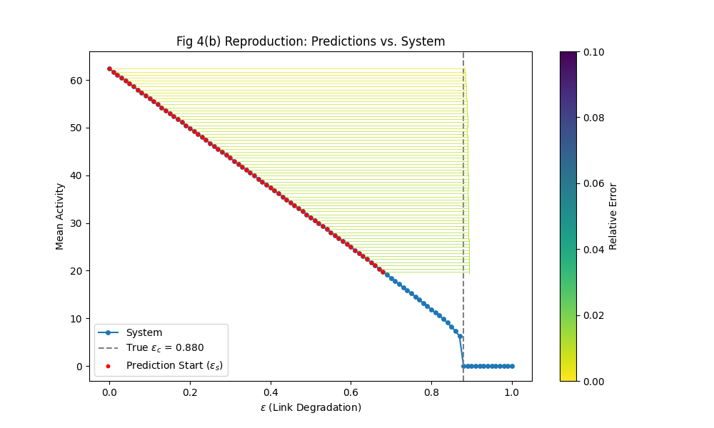
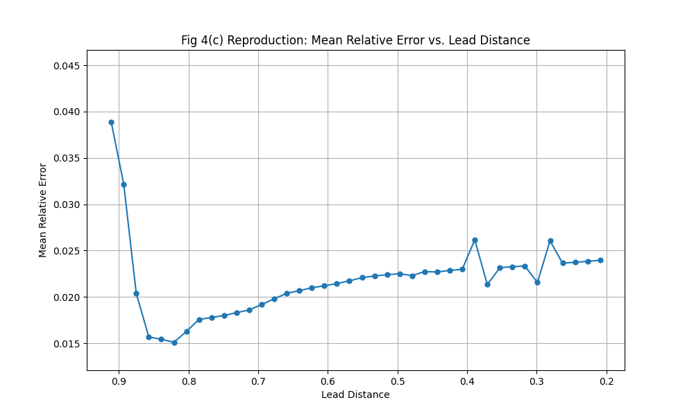
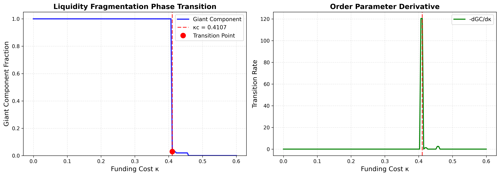
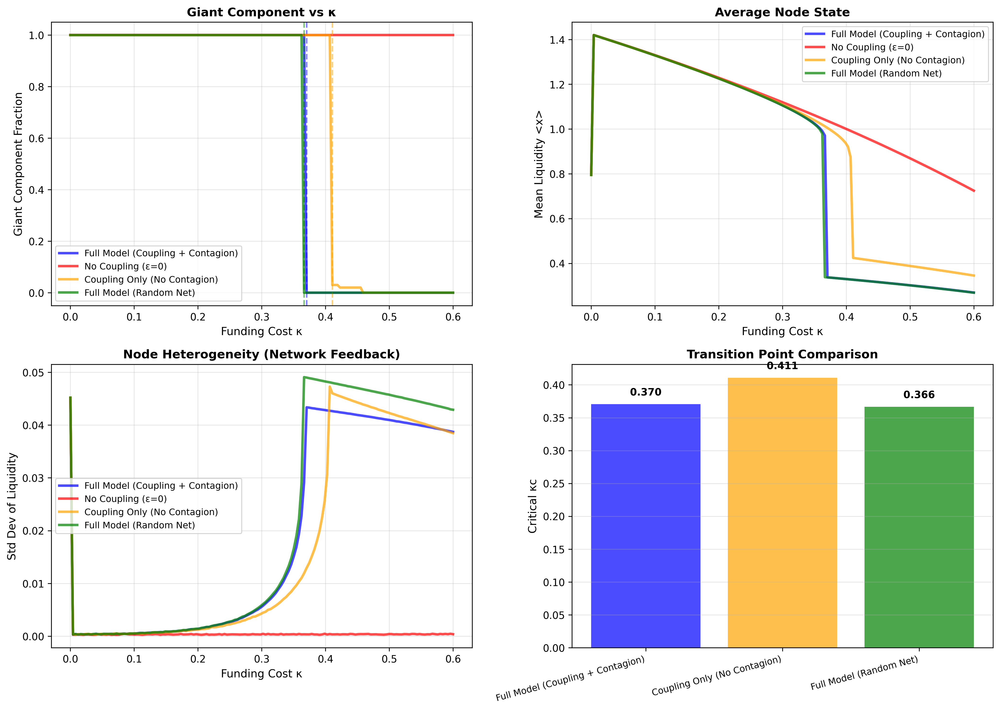

# Early Warning Signals for Critical Transitions in Financial Networks

Networked dynamical systems — markets, interbank lending networks, neuronal populations — can undergo *critical transitions*: a control parameter drifts past a tipping point and the system collapses abruptly. This project implements the deep-learning framework of [Liu et al., *Phys. Rev. X* **14**, 031009 (2024)](https://doi.org/10.1103/PhysRevX.14.031009) and applies it to financial-network models: a **GIN-GRU regressor** that reads a short window of pre-transition node time series and predicts *where the tipping point is* — before the system gets there.

## Method

Every experiment follows the same recipe:

1. **Simulate** an ensemble of networked systems ("universes"), ramping a control parameter until each undergoes a critical transition. The transition value (ε_c or κ_c) is recorded as the regression label.
2. **Window** the pre-transition time series into sliding windows of `w = 20` timesteps × N nodes. Every window inherits its universe's label — so the model must infer the tipping point from dynamics observed well before it.
3. **Train** a graph-temporal regressor: **GIN** layers encode each timestep's network state → global pooling produces a per-timestep graph embedding → a **GRU** reads the embedding sequence → an MLP head regresses the predicted tipping point. Loss is MSE against the true transition value.

The trained model generalizes across network sizes, topologies, and dynamics parameters it never saw, because it learns the *dynamical signatures* of an approaching transition rather than any particular network.

## The three systems

### 1. Wilson-Cowan neuronal dynamics — [`wilson_cowan/`](wilson_cowan/)

A reproduction of the PRX paper's core result. Ensembles of Erdős–Rényi networks with Wilson-Cowan firing-rate dynamics are swept over coupling ε; the model predicts the critical ε_c from pre-transition activity windows.

| Predictions along one trajectory | Predicted vs. true ε_c (test set) |
|---|---|
|  |  |

Run it: `cd wilson_cowan && uv run python main.py` (edit `G` in `config.py` — 100 for a quick run, 1000 for the full reproduction). `wilson_cowan_clean.ipynb` is a self-contained notebook version with parameter studies over network size, degree, and dynamics constants.

### 2. Interbank liquidity fragmentation — [`liquidity/`](liquidity/)

An original ODE model of an interbank lending network: node liquidity evolves under local dynamics plus lending/contagion coupling, while funding cost κ ramps up. Past a critical κ_c, the network of active lending links fragments — the giant component collapses:



`generate_training_data.py` builds a supervised dataset across topologies (Erdős–Rényi sparse/dense, scale-free), network sizes, and dynamics parameters, with windows extracted at multiple lead distances from the transition; `train_model.ipynb` trains the GIN-GRU predictor on it. Validation sweeps and contagion analysis:



Dataset format and generation options are documented in [`liquidity/TRAINING_DATA_README.md`](liquidity/TRAINING_DATA_README.md). A pre-generated dataset (`training_data/`, ~5,000 windows from 100 simulations) ships with the repo.

### 3. Synthetic correlated market — [`training_data.py`](training_data.py) + [`market_model.ipynb`](market_model.ipynb)

A stylized equity market: N stocks in K sectors, with inter-sector correlation ε as the fragility knob. As ε rises, diversification vanishes and the market approaches a regime where the correlation structure degenerates (loss of positive-definiteness — all stocks move as one). The model predicts the critical ε_c from windows of simulated returns.

### Supporting material

- [`goodwin/`](goodwin/) — an exploratory Goodwin-style macroeconomic network (`simulator.py`: bank/firm nodes with loans, deposits, and default contagion) with generated simulation runs.
- [`docs/toy_model_spec.md`](docs/toy_model_spec.md) + [`paper.ipynb`](paper.ipynb) / [`plot.ipynb`](plot.ipynb) — a minimal toy model of firm-network tipping (logistic dynamics with coupling on a Barabási–Albert graph) with Jacobian-eigenvalue stability analysis, used to build intuition for the full systems.
- [`final-results/DPCN_Project.pdf`](final-results/DPCN_Project.pdf) — the full project write-up.

## Quickstart

Requires [uv](https://docs.astral.sh/uv/). Python 3.12 and all dependencies (CPU-only PyTorch by default) are pinned and locked:

```bash
uv sync                                  # create environment from uv.lock

uv run pytest                            # smoke tests
uv run python training_data.py          # 10-universe market-model smoke run
cd wilson_cowan && uv run python main.py # full Wilson-Cowan pipeline
```

Training runs on CPU; CUDA is used automatically when a GPU build of PyTorch is installed.

## Repository layout

```
wilson_cowan/        Wilson-Cowan pipeline (modular: config, simulation, dataset, model, plots)
liquidity/           liquidity-fragmentation model, dataset generator, training notebook
goodwin/             Goodwin-style macro network simulator
training_data.py     synthetic-market universe generator
market_model.ipynb   end-to-end market-model notebook (data → training → evaluation)
docs/                toy-model specification
tests/               fast CPU smoke tests
```

## Reference

Liu, Z., et al. *Early Predictor for the Onset of Critical Transitions in Networked Dynamical Systems.* Physical Review X 14, 031009 (2024). [doi:10.1103/PhysRevX.14.031009](https://doi.org/10.1103/PhysRevX.14.031009)
